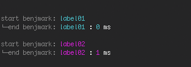

# benjmark [](https://travis-ci.org/radiovisual/benjmark)

> Super-simple benchmarking library with clean API


## Install

```
$ npm install --save benjmark
```


## Usage

```js
const Benjmark = require('benjmark');

const benjmark = new Benjmark();

benjmark.start();

function longRunningProcess() {
    // ...
}

benjmark.end();
```

## Benjmark With Labels

Benjmark will let you assign labels to your benchmarks for more semantic logging. The console will assign different colors to multiple labels. If no label is assigned, then benjmark assigns numbers.

```js
benjmark.start('label01');
benjmark.end();

benjmark.start('label02');
benjmark.end();
```

# 


## API

### Benjmark()

The Benjmark class. 

### benjmark.start(label)

Type: `string`

Optional labeling of your individual benjmarks to the console. 

### benjmark.end()

End the benjmark process and restart the timer for your next benjmark.

## License

MIT © [Michael Wuergler](http://numetriclabs.com)
